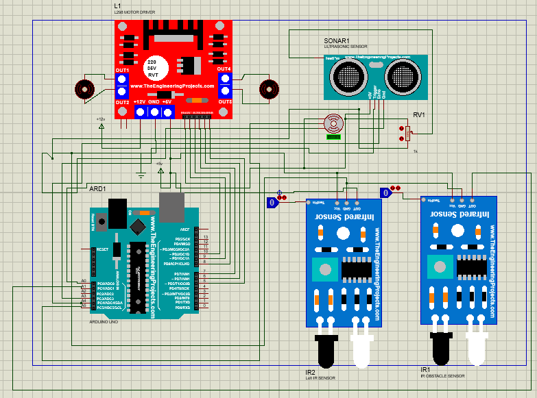

# Obstacle-avoiding-line-follower-
An autonomous line follower robot built with Arduino that can detect and avoid obstacles
This is a fully functional, autonomous line follower robot built with an Arduino UNO. It successfully follows a black line and uses an ultrasonic sensor to detect and navigate around obstacles.
## Key Features
- **Line Following:** Uses two IR sensors to accurately track a black line.
- **Obstacle Detection:** An ultrasonic sensor detects objects in front of the robot.
- **Autonomous Navigation:** When an obstacle is found, the robot stops, scans for a clear path with a servo, and executes a turn to avoid the object.
## Photos of the Final Built 

## Component Used 
- Arduino UNO
- L298N Motor Driver
- 2x DC Geared Motors & Wheels
- 2x IR Sensor Modules
- HC-SR04 Ultrasonic Sensor
- SG90 Micro Servo Motor
- 2x 18650 Li-ion Rechargeable Battery
## Circuit diagram

## Code
The complete code for the robot is available in the `obstacle_avoiding_line_follower.ino` file in this  repository.
